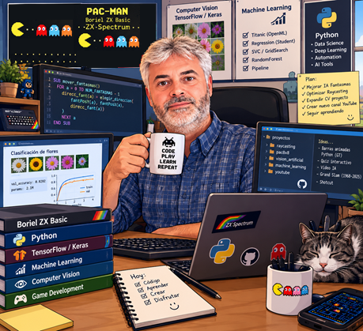

::: {.column-margin}
<!-- 
 -->
{.profile-photo}
<!-- 
 -->
:::

Soy un entusiasta del mundo de la programación. He aprendido de forma autodidacta y mediante formaciones especializadas a desplegar proyectos web con diversas tecnologías, principalmente en los entornos de **spring/java** y **node.js**.

Domino varios lenguajes de programación como java, javascript, C# y sobre todo **python**, mediante el cual me he introducido en el **Machine Learning**, **Deep Learning**, **agentes y automatizaciones IA**, **MLOPs**, etc.

También como hobby me gusta programar pequeños videojuegos principalmente con el motor gráfico de uso profesional Unity.

